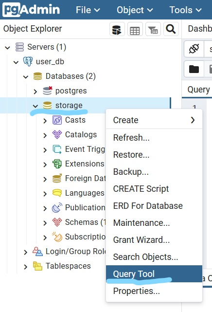

# Заметки по выполнению тестового задания на позицию DE

[Условия задачи](#условия-задачи) \
[Принятые допущения](#принятые-допущения) \
[Описание вариантов](#описание-вариантов)

[Здесь](./code/) находятся `.py` файлы

Процес поднятия среды для запуска скриптов описан [здесь](#запуск-среды-для-проверки-работы-скриптов)

Проверка результатов [здесь](#проверка-результатов-работы)

## Условия задачи

Создать коннектор для получения информации в виде JSON из источника используя API, преобразование данных в табличный вид и загрузка в базу данных.

## Принятые допущения

Ввиду отсутствия ограничений и четких требований реализовано два варианта решения задачи:

1. Используя Airflow и его компоненты и возможности
2. Описан процесс в виде Python скрипта

## Описание вариантов

### 1 Использование AirFlow

Код можно посмотреть [здесь](./code/airflow_process.py)

Airflow позволяет создавать и хранить параметры различных подключений. В этом примере мы будем использовать этот подход.

Данный процесс служит для обработки информации из первого API

(Замечание: в данном примере для передачи данных между тасками используется Xcom, что НЕ является "Best Practice")

DAG состоит из 4 шагов (Tasks):
Проверка API \
Получение данных \
Проверка таблицы \
Загрузка в БД

Для реализации используются: \
`HttpSensor` - для проверки доступности API \
`HttpSimpleOperator` - для получения данных \
`PostgresOperator` - для проверки наличия таблицы в базе данных и создание в случае её отсутствия \
`PostgresHook` - для получения информации для подключения к БД из AirFlow

В UI Airflow в меню `Admin -> Connections` необходимо создать два подключения `postgre-conn` и `source_api`. (Подробнее в части [запуск](#запуск-среды-для-проверки-работы-скриптов))

### 2 Скрипт для отдельного запуска или планирования с помощью crontab

Код можно посмотреть [здесь](./code/script.py)

Для запуска необходимо установить библиотеки из [списка](./code/requirements.txt)

В скрипте реализованы:
Получение данных из API \
Деконструкция JSON \
Преобразование в DataFrame \
Загрузка в БД

Есть возможность подтягивать информацию для подключений (логин, пароль и тд. для БД) из переменных окружения

## Запуск среды для проверки работы скриптов

Для запуска должны быть установлены Docker и Docker-compose

Перед запуском в любом из вариантов нужно клонировать репозиторий на локальнуюю машину

### 1 Airflow

В папке [dags](./test_env/dags/) находится копия скрипта для AirFlow. \
В этом файле в строке `44` при необходимости нужно изменить дату и время начала работы

В терминале перейти в директорию `test_env` и выполнить команду `docker compose up`

В результате запустится 3 контейнера:

- База Данных
- AirFlow
- pgAdmin

После запуска (занимает некоторое время) в браузере будет доступно 2 адреса:

- `localhost:8080` - Интерфейс пользователя Airflow
- `localhost:5050` - Интерфейс пользователя pgAdmin

Переходим в UI AirFlow (Логин, пароль - user)

В меню `Admin -> Connections` необходимо создать два подключения `postgre-conn` и `source_api` со следующими параметрами:

**postgre-conn**

- Connection Id - `postgre_conn`
- Connection Type - `Postgres`
- Host - `db`
- Schema - `storage`
- Login - `user`
- Password - `user`
- Port - `5432`

**source_api**

- Connection Id - `source_api`
- Connection Type - `HTTP`
- Host - `https://random-data-api.com/api/`

После того как мы создали соединения, можно запустить DAG в работу \
(Если время запуска не изменялось DAG выполнится, и в дальнейшем будет выполняться каждые 12 часов)

как посмотреть результат работы описано [ниже](#проверка-результатов-работы)

### Запуск скрипта для проверки работоспособности

В файле [docker-compose.yaml](./test_env/Docker-compose.yaml) закомментировать блок с сервисом `airflow`, сохранить изменения

В терминале перейти в директорию `test_env` и выполнить команду `docker compose up`

В результате запустится 2 контейнера:

- База Данных
- pgAdmin

После запуска (занимает некоторое время) в браузере будет доступен адрес:

- `localhost:5050` - Интерфейс пользователя pgAdmin

(Предполагается наличие установленного python версии >= 3.10)

в терминале перейти в директорию `code` и выполнить команду для установки необходимых библиотек `pip install -r requirements.txt`

После завершения установки запустить скрипт командой `python script.py` (команда может отличаться в зависимости от ОС)

после выполнения можно проверить результат

### Проверка результатов работы

В браузере открыть адрес `localhost:5050` (pgAdmin)

для входа используется:

- Email - `user@user.com`
- Password - `user`

Далее необходимо создать подключение. Для этого:

В левом верхнем углу кликаем на `Servers` и после на вкладке `Dashboard` выбираем `Add New Server`


В открывшемся окне в поле `name` вводим имя подключения


Во вкладке `Connection` ввести информацию:

- Host Name - `db`
- Port - `5432`
- Maintenance database - `storage`
- Username - `user`
- Password - `user`

И нажимаем сохранить


После подключения можем выполнять SQL запросы к нашей базе.

```SQL
-- получить загруженные строки из таблицы canabis_data
SELECT * FROM canabis_data;

-- и из таблицы nhl_stats
SELECT * FROM nhl_stats;
```

Для этого нажимаем правой кнопкой мыши на бд `storage` и раскрывшемся меню `Query Tool`


